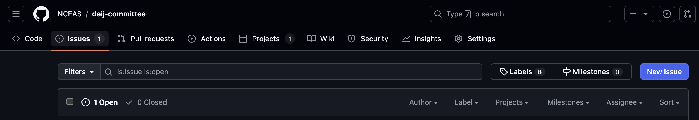

# NCEAS Diversity, Equity, Inclusion, and Justice (DEIJ) Committee

This repository houses the task management system (primarily GitHub issues) for the NCEAS DEIJ committee. For more information, see [nceas.ucsb.edu/DEIJ](https://www.nceas.ucsb.edu/DEIJ).

## GitHub Issue FAQ

GitHub issues are a great way of tracking tasks (especially in coding contexts). They are super versatile and as a committee we only need to use some of their functionalities but if you're curious, check out these tutorials ([LTER tutorial](https://lter.github.io/workshop-github/issues.html), and of course, [GitHub's own documentation](https://docs.github.com/en/issues)).

## Find Issues

To find issues, go to the repository on GitHub (good news: if you're reading this you're likely already in the right place!)

Once there, click the "Issues" tab in the upper left just beneath the repository owner / name.

**If the issue you want already exists, simply click it to join the conversation on that task!** If the issue you want doesn't (yet) exist, you'll need to make it so follow along with the next phase of the tutorial.

## Create an Issue

To begin, click the "New Issue" button in the upper left of the issues page (this button is likely [**blue**]{style="color:blue"} or [**green**]{style="color:green"})

We've created an issue 'template' that starts each issue with a broadly-useful skeleton that might help you provide useful detail to others. To use this template, **click "Get Started" on the template labeled "Task Template"**

You will then find yourself in an empty issue that you can flesh out with the details of the task. Likely useful subheadings are included but you don't necessarily need to use them exactly if they don't fit what you have in mind.

At a minimum, consider "assigning" yourself or someone else as the lead person (see the sidebar on the right) and pick a "label" that describes the general category of this task (especially if it is directly related to one or more of the goals in NCEAS' DEIJ Strategic Plan document). In the example screenshot below I've included a "Project" assignment which is another level of project management supported by GitHub.

Once you're satisfied with this content, click "Submit new issue" in the bottom right. Note that **you can edit *all* of this later if needed!**

Once the issue is opened, you'll see that some of the computer formatting (e.g., \# for headings, etc.) gets rendered into something that is more visually appealing and interpretable. This is called "markdown syntax" and is broadly useful but not a requirement of using issues effectively. If it is of interest, check out [this guide](https://www.markdownguide.org/basic-syntax/).

If you chose to add this issue to a project, click the "No status" dropdown beneath the project name (right sidebar) and pick a status that feels appropriate to the issue from the available options. As an example, below I selected "Todo" for this issue.

Once you navigate back to the "Issues" tab of the repository, you should see your new issue--along with most of the metadata that you added--in the list of open issues so it should be straightforward for others to jump in and help out!

